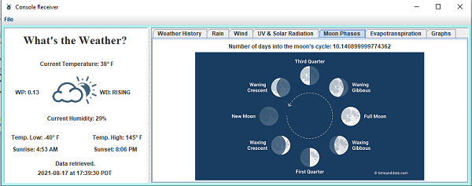

Vantage Pro 2 console receiver imitation.

This project was inspired by the specifications of the VantagePro2:

https://www.davisinstruments.com/products/vantage-pro2-groweather-wireless-integrated-sensor-suite

The Console Receiver shows data regarding Rain, Wind, UV Radiation, Humidity, and Moon Phases.

Weather History:

Rain:

Wind:

UV Solar Radiation:

Moon Phases:

